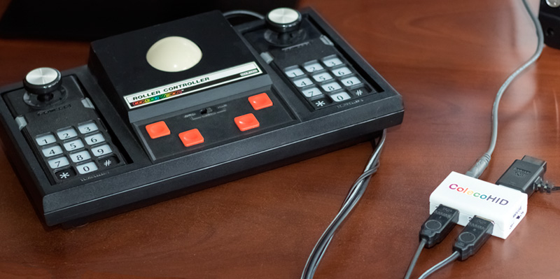
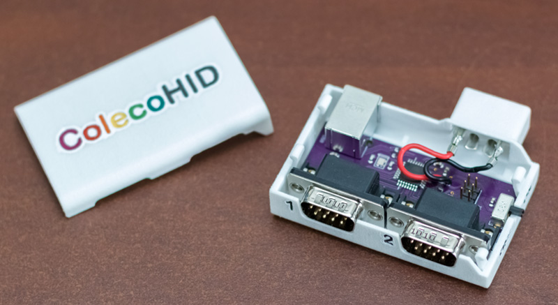
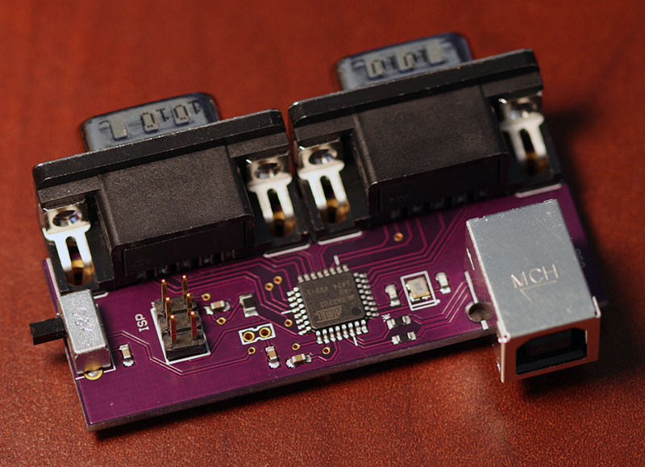
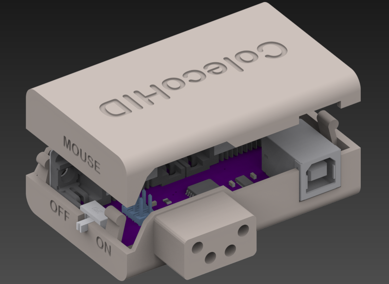

# ColecoHID: A USB adapter for the ColecoVision Roller Controller

I was able to find lots of ColecoVision-to-USB adapters, but none that supported the Roller Controller accessory.

**[Watch the video!](https://youtu.be/rTsxjneUAzo)**

The Roller Controller connects to the ColecoVision console using controller ports 1 and 2 simultaneously, which means a single-port USB adapter won't work.  The Roller Controller also requires a bit of extra power using a curious pass-through cable with a proprietary connector.  ColecoHID solves both problems in one compact adapter.

## Features

- Fully HID-compliant USB 2.0 game pad inputs, so it should work on any operating system without a driver.
- A toggle switch for "mouse mode" which combines the quadrature axes from both controller ports into an HID-compliant mouse input.  (This lets you use the ColecoVision Roller Controller as a track ball mouse.  This is also required for playing some games with the Roller Controller in emulators like [MESS](http://www.mess.org/).)         
- Supports 2x standard ColecoVision controllers, 2x Super Action Controllers (including their wheels), or the Roller Controller.
- Additional (untested!) support most likely includes standard Atari joysticks and Sega Genesis controllers.

## Design Notes

The final design uses an Atmel [ATmega32U2](http://www.atmel.com/devices/ATMEGA32U2.aspx) which supports full speed USB 2.0.  A 3D-printed enclosure replicates the Roller Controller's proprietary power connector.  Conveniently, it only requires a small bit of current at 5V, so it's able to use USB bus power directly.

The majority of the initial technical info for the project came from [Deathskull Labs](http://arcarc.xmission.com/Web%20Archives/Deathskull%20(May-2006)/games/tech/index.html).  Thanks guys!

Printing [the case](http://www.shapeways.com/product/W9YRKPY3Y) at Shapeways in "White Strong and Flexible, Polished" created a nice result.  (The current case has a small deficiency: while the retaining clips hold things in place along two dimensions, the top cover has a tendency to slide forward and backward.  This makes it a little easier to open, so maybe it's a feature!)    

The enclosure is made to accept crimped Molex pins, which seem to work well with the original ColecoVision hardware.  I bought two sizes (14-20 and 18-22 gauge) but my notes are unclear which ended up being the correct size.  (Sorry!)

This project included a lot of firsts for me: my first USB device, my first circuit board layout, my first 3D case design.  So, expect some rough edges (like the sliding top of the case).  That said, the code can serve as a simple HID-USB example project using the [LUFA USB library](http://www.lufa-lib.org).

I had a set of three PCBs made from the gerber files by [OSH Park](https://oshpark.com/) for about $12.

The firmware can be built using Atmel Studio.  I programmed the ATmega32U2 using an [AVRISP mkII](http://www.atmel.com/tools/AVRISPMKII.aspx).  (The board includes the six pin programming header for the AVRISP.)

The rest of the components were from [DigiKey](http://www.digikey.com/).  See the BOM below for the full list, but it ends up being somewhere in the neighborhood of $15 for single-unit quantities of all the parts. 

The PCB uses some surface mount components.  You can print a stencil from [OSH Stencils](https://www.oshstencils.com/) (using the same gerber files) for about $5.  That stencil, some solder paste, a pair of tweezers, and a hotplate is all it took to re-flow solder the board.  None of the components are very fine-pitch, so you could probably get away with using a soldering iron or hot air tool instead. 

# Bill of Materials

<table>
    <tr>
        <td>Item</td>
		<td>Digikey part number</td>
		<td>Qty Required</td>
    </tr>
    <tr>
        <td>ATMega32U2-AU</td>
        <td>ATMEGA32U2-AU-ND</td>
        <td>1</td>
    </tr>
    <tr>
        <td>DSUB 9</td>
        <td>609-4002-ND</td>
        <td>2</td>
    </tr>
    <tr>
        <td>16.0 MHz 4-pad crystal, 2.5x2 mm</td>
        <td>644-1059-1-ND</td>
        <td>1</td>
    </tr>
    <tr>
        <td>USB B connector</td>
        <td>WM17113-ND</td>
        <td>1</td>
    </tr>
    <tr>
        <td>mini SPDT switch</td>
        <td>CKN9559-ND</td>
        <td>1</td>
    </tr>
    <tr>
        <td>6-pin programming header</td>
        <td>609-3210-ND</td>
        <td>1</td>
    </tr>
    <tr>
        <td>0603 1uF capacitor</td>
        <td>311-1446-1-ND</td>
        <td>5</td>
    </tr>
    <tr>
        <td>0603 10pF capacitor</td>
        <td>311-1058-1-ND</td>
        <td>2</td>
    </tr>
    <tr>
        <td>0603 22 resistor</td>
        <td>311-22.0HRCT-ND</td>
        <td>2</td>
    </tr>
    <tr>
        <td>0805 10k resistor</td>
        <td>311-10.0KCRCT-ND</td>
        <td>1</td>
    </tr>
    <tr>
        <td>Solder paste (leaded)</td>
        <td>KE1507-ND</td>
        <td></td>
    </tr>
    <tr>
        <td>ColecoHID PCB v1</td>
        <td>from OSH Park</td>
        <td>$12 for three</td>
    </tr>
    <tr>
        <td>Solider paste stencil</td>
        <td>from OSH Stencils</td>
        <td>$5</td>
    </tr>
    <tr>
        <td>Shapeways Enclosure</td>
        <td><a href="http://www.shapeways.com/product/W9YRKPY3Y">from Shapeways</a></td>
        <td>$21</td>
    </tr>
    <tr>
        <td>Molex (14-20 or 18-22) Gauge Pins 0.093" (I'm not sure which size, sorry!)</td>
        <td>from Amazon.com</td>
        <td>two male, two female</td>
    </tr>
    <tr>
        <td>Red / black hookup wire</td>
        <td></td>
        <td>a few inches</td>
    </tr>
</table>

## Future Work

- Use a micro-B USB connector instead of a full-size B connector.
- Push the USB port as far back onto the PCB as possible instead of having it dangling off the end, requiring a larger case.
- Strengthen the case where the Roller Controller power is plugged in.  It flexes a little too much when plugging and unplugging. 
- Compress the board layout a lot more.  The final case volume could trivially be half what it is today.
- Fix the sliding top half of the case by adding a couple more retention clips on the other axis.
- Create a software utility (and updated firmware) to allow user control of joystick and mouse configuration and sensitivity.
